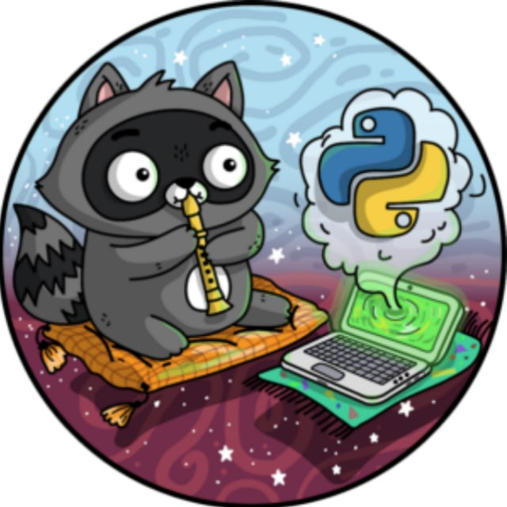

<h1 align="center">Good day to you, I am Evgeny
</h1>
<h1 align="center">

## Contents

0. [About me](#about-me)
1. [Social Networking Services](#social-networking-services)
2. [Stack](#stack)
3. [Activity](#activity)
4. [Languages Stats](#languages-stats)

## ---

### About me

Hello stranger. My name is Eugene Bespalov, I am a postgraduate student at **ITMO** University, while also studying at **School21**  vocational programming school since January of 2023. So far I have completed about 15 programming projects, most of which
were team projects and in some of them I acted as TeamLead.

While I enjoy different programming languages and IT activities ranging from DevOps to QA Automation, my heart lies with the backend application development in Java and in DBMS.

---

### Social Networking Services

    
    
    

---

### Stack

  &nbsp
  &nbsp
  &nbsp
  &nbsp
  &nbsp
  &nbsp
  &nbsp
  

---

### Activity

<table>
  <tr>
    <td>
      
    </td>
  </tr>
</table>

---

### Languages Stats

<table>
  <tr>
    <td>
      
    </td>
  </tr>
</table>

---

###### Readme.md v. 2.0.1. Update from 14.10.2023
